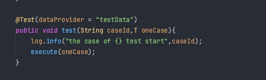
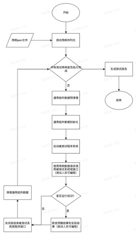
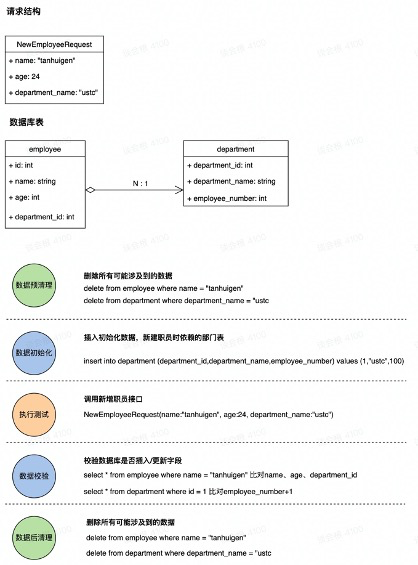

# JulyIntegrationTest


## 基本介绍

`JulyIntegrationTest` 是一个Spring下的集成测试框架，底层使用`SpringBootTest` 和`TestNg`，并支持多种服务端通用组件的测试，其主要的特点如下：

- `数据驱动测试`
    - 使用简单的json数据，即可完成测试过程所需的各类操作，这也是自动化测试和持续集成的基础
- `通用组件测试`
    - 支持Mysql、Redis和消息队列的测试，数据驱动过程中测试框架自动完成初始化测试所需的上下文，在测试结束时自动进行数据校验，结束后进行数据清理
- `依赖模拟`
    - 底层使用SpringTest的Mockito，将依赖模拟粒度控制在函数层级，支持以数据驱动的方式完成依赖模拟操作
- `组件监控`
    - 支持监控测试Mysql、Redis和消息队列的行为，包含测试系统和被测系统。以Mysql为例，会监控其在每个阶段所执行的sql语句、耗时、返回信息等监控内容。
- `可视化测试报告`
- `其他功能特点`
    - `通用模版注入`
    - `随机数占位符替换`
    - `中间件隔离`

## 简单使用

1. 首先定义一个Demo被测系统，demo中有一个接口insertOne用于向mysql中插入一个student对象。

``` java
    @Insert("insert into student (student_id,name,age) values (#{studentId},#{name},#{age})")
    void insertOne(@Param("studentId")Long studentId,@Param("name") String name,@Param("age") int age);

```

2. 随后编写json测试文件，其中initDataSet用作数据清理，checkDataSet用于mysql的数据校验

```json
[
  {
    "caseId": "1759519286626369600",
    "name" : "[CID:1759519286626369600]test-1",
    "random" : {
      "studentId" : "Long"
    },
    "mysql" : {
      "initDataSet" : [
        {
          "dsName" : "db3",
          "table" : "student",
          "fields" : {},
          "deleteKey" : {
            "student_id" : "$studentId"
          }
        }
      ],
      "checkDataSet" : [
        {
          "dsName" : "db3",
          "table" : "student",
          "fields" : {
            "student_id" : "$studentId",
            "name" : "tanhuigen",
            "age": 18
          },
          "selectKey" : {
            "student_id" : "$studentId"
          }
        }
      ]
    },
    "studentId": "$studentId",
    "studentName": "tanhuigen"
  }
]
```

3. 接着编写测试主类

- 定义json文件序列化的MyCase类

```java
@Data
@EqualsAndHashCode(callSuper = true)
public class MyCase extends BaseCase {
    Long studentId;
    String studentName;
}
```

- 编写测试类

```java
@ActiveProfiles(value = {"dev_test"})
//@Listeners(JulyTestListener.class)
//@JulyMockScan(basePackageClasses = MyMock.class)
@SpringBootTest(classes = {IntegrationApplication.class, DemoApplication.class})
public class MyTest extends TestBase<MyCase> {

    @Autowired
    StudentDAO studentDAO;
  
    @Override
    protected String filePath() {
        return "/data/case.json";
    }

    @Override
    protected void doAction(MyCase myCase) {
        Long studentId = myCase.getStudentId();
        String studentName = myCase.getStudentName();
        studentDAO.insertOne(studentId,studentName,18);
    }
}

```

其中TestBase类里包含了测试启动的@Test函数，所以运行即可



4. 测试结束

## 整体运行







